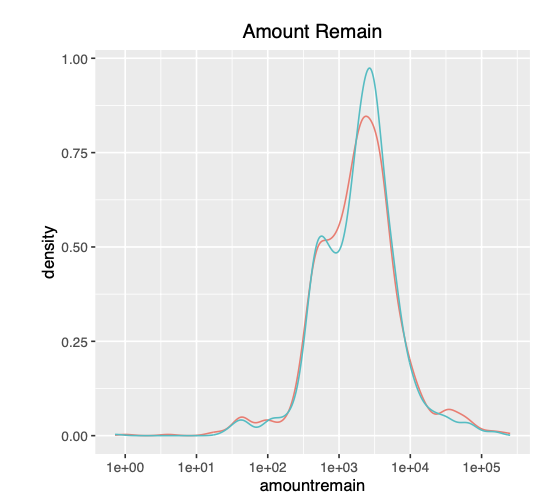

# Statistics Project
# Naoko Ishibashi

### Junior Data Analyst

#### Technical Skill: R, SQL, Java, Python

## Education
- B.A.A.S, University of Pennsylvania| Data Analytics & Social Sciences (_August 2024_)
- A.S, Community College of Philadelphia | Computer Science (_May 2021_)

## Experience
Data Analyst and Programmer Intern @ Senior Grooming (_August 2023_)

- Analyzed demographic data with R to produce reports that supported strategic expansion.
- Programmed Java for API integrations with SendGrid to manage transactional emails.
- Developed custom email templates in SendGrid, improving user experience and ensuring brand consistency.

## Certifications
- Introduction to Database and SQL, Great Learning (_June 2024_)
  
## Project
### 1. Regression Analysis in Base R     
[Publication](https://github.com/naokoi0408/Final.Data310/blob/main/Regression%20Analysis%20/Regression_Analysis%20.pdf)

Utilized regression analysis, multivariate regression, statistical, and probability analysis on 2020 US National Election Survey data to assess voter sentiment towards the Democratic Party. Applied sampling theory, cleaned data, and created concise visualizations to summarize findings.
- Skills: R, statistics, data visualization.

### 2. Measurement and Description     
[Publication](https://github.com/naokoi0408/MeasurementAndDescription.Data310/blob/main/1.MeasurementAndDescription.Data310/HW1_Data310_Naoko.pdf)

This homework assignment analyzes racial differences in legal financial obligations owed to the state of Alabama, using descriptive statistics and visualizations. It also tests a theory on college basketball game outcomes by calculating conditional probabilities.

From the feedback, I learned the importance of accurate calculations and avoiding unnecessary complexity. To achieve a perfect score, I needed to accurately calculate the mean of absolute values in questions 3a and 3c. Additionally, in question 3b, I overcomplicated the event calculations and confused some variables, which affected the final probability results.

### 3. Sampling Theory    
[Publication](https://github.com/naokoi0408/3.SamplingTheory.Data310/blob/main/3.SamplingTheory.Data310/HW3_Data310.pdf)

In this assignment, I explored sampling distribution concepts by illustrating how smaller sample means can approximate population data. I applied the Central Limit Theorem to calculate confidence intervals, showing how larger sample sizes improve accuracy, and justified the cost of surveying more people. Using Ohio 2016 election data, I estimated Trump’s vote share and analyzed regional precincts, calculating mean, variance, and confidence intervals for different sample sizes. 

Feedback from my professor helped me refine my calculations, emphasizing accurate application of population and sample statistics.

### 4. Estimators
[Publication]()
In this assignment, I analyzed polling data using various statistical methods, focusing on confidence intervals for respondents' attitudes toward Hillary Clinton. I used the `t.test()` function to calculate 95% confidence intervals, differentiating between respondents voting for Clinton and those who did not. I found a significant mean difference in warmth toward Clinton between Clinton voters and non-voters, then confirmed these results using the `lm()` function for regression analysis. 

Through this analysis, I gained insights into how variables like political affiliation and education level influence respondents' sentiments toward Clinton.

